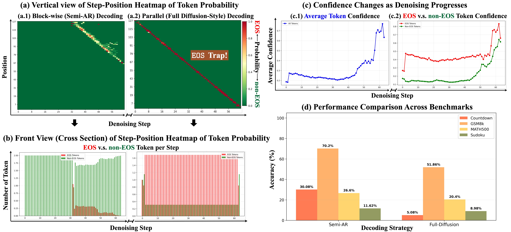
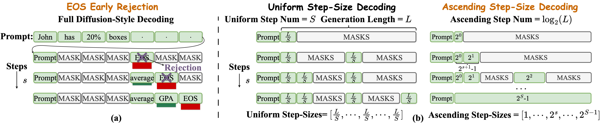
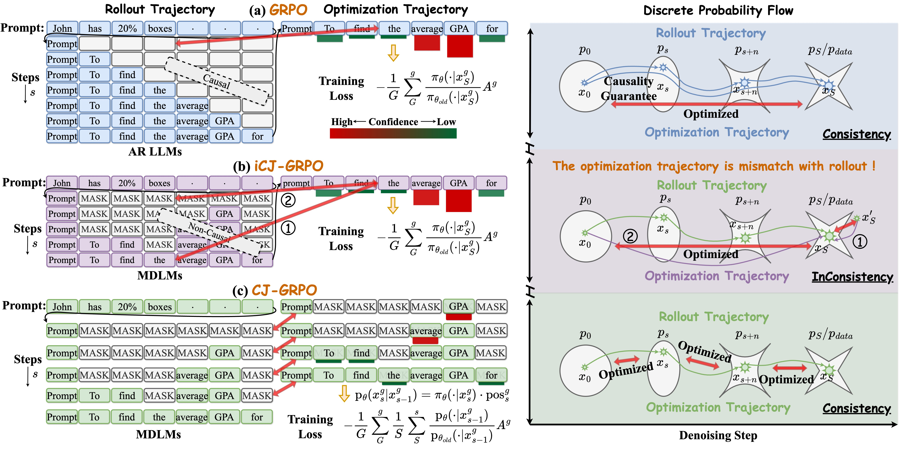
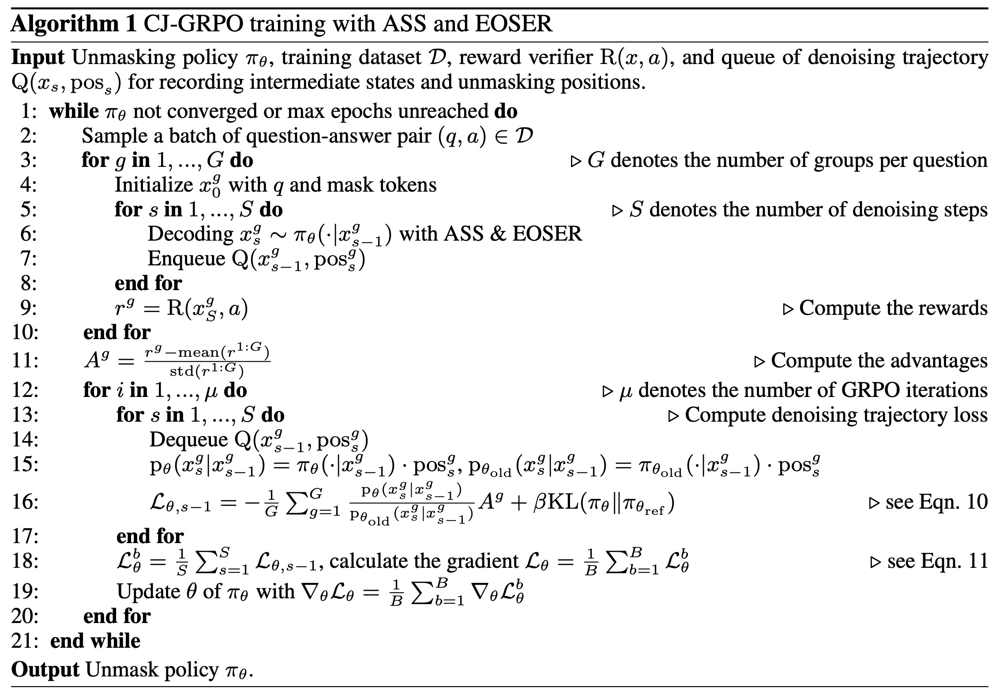

<div  align="center">
    <h1><a href="https://arxiv.org/pdf/2509.23924" target="_blank">Taming Masked Diffusion Language Models via Consistency Trajectory Reinforcement Learning with Fewer Decoding Step</h1>

  <span style="color:red">📢 <strong><i>If you also engaged in the research of MDLMs or RL, we welcome your suggestions. And feel free to create an issue, when you have any questions about the code.
  If you are interested in our work, please star ⭐ our repository, Thx 💕.</i></strong></span>

  <h4>
     
    
    
    
    
  </h4>
</div>

<p>We propose EOS Early Rejection (EOSER) decoding and Ascending Step-Size (ASS) scheduler, which unlock the potential of MDLMs to perform full diffusion-style decoding, achieving competitive performance with fewer decoding steps. Additionally, we introduce Consistency Trajectory Group Relative Policy Optimization (CJ-GRPO) for taming MDLMs, which emphasizes the consistency between rollout trajectory and optimization trajectory. The experimental results demonstrate that the proposed EOSER and ASS mechanisms, together with CJ-GRPO, hold significant promise for effectively and efficiently taming MDLMs.</p>



<div align="center">
  <hr width="100%">
</div>

## 📢 Updates

* 09-30-2025: We released our [paper](https://arxiv.org/pdf/2509.23924).
* 09-28-2025: We released the code of Taming Masked Diffusion Language Models via Consistency Trajectory Reinforcement Learning with Fewer Decoding Step.

<div align="center">
  <hr width="100%">
</div>


## ⚙️ Environment Setup

To setup the environment, run:
```
conda env create -f env.yml
conda activate EOSER-ASS-RL
```

## 🚀 SFT

The code for Supervised Fine-Tuning (SFT) is sourced from the [d1](https://github.com/dllm-reasoning/d1/tree/main/SFT). sft results can be reproduced with the command:
```bash
# First go to the sft directory
cd sft

CUDA_VISIBLE_DEVICES=0,1 accelerate launch --config_file ddp_config.yaml --main_process_port 29500 --num_processes 2 sft_train.py --grad_accum_steps 4 --batch_size 1 --num_epochs 20 
# this results in effective batch size of 8 = 1 * 2 * 4, where 2 is the number of gpus.
```

## 🚀 EOSER Decoding and ASS Scheduler 

The code of EOSER and ASS is inside the `eval/generate.py`.



```
# EOSER Decoding
def sampling(logits, x0, remasking, eos_id, dtype, step_idx=None, total_steps=None, eos_min_gamma=0.4, eos_max_gamma=1.0):
        assert remasking == "low_confidence", f"Expected remasking == low_confidence in sampling"
        p = F.softmax(logits.to(dtype), dim=-1)
        x0_p = torch.squeeze(
            torch.gather(p, dim=-1, index=torch.unsqueeze(x0, -1)), -1
        )
        # Soft, step-dependent EOS suppression
        min_fac = eos_min_gamma 
        max_fac = eos_max_gamma
        if step_idx is not None and total_steps is not None and total_steps > 1:
            t = min(max(step_idx, 0), total_steps - 1) / (total_steps - 1)
            fac = min_fac + (max_fac - min_fac) * t  # linear schedule: strong suppression early -> none late
        else:
            fac = max_fac
        x0_p = torch.where(x0 == eos_id, x0_p * fac, x0_p)
        return x0_p
```
```
# ASS Scheduler
def get_num_transfer_tokens_ass(prompt, steps, block_sizes):
    """
    Generate exponential token transfer schedule where step i transfers 2^i tokens.
    Each block size is 2^s - 1, and total generation length is 2^L - 1.
    
    Args:
        mask_index: Boolean mask indicating which tokens are masked
        steps: Total number of diffusion steps per block
        schedule: Not used in this function but kept for compatibility
    """
    batch_size = prompt.shape[0]
    
    # Calculate number of tokens to transfer at each step: 2^i for step i
    num_transfer_tokens = torch.zeros((batch_size, steps), device=prompt.device, dtype=torch.int64)
    
    for i in range(steps):
        if i == steps - 1:
            if len(block_sizes) == 1:
                num_transfer_tokens[:, i] = block_sizes[-1] - (2 ** i - 1)
            elif block_sizes[-1] > 2 ** i:
                num_transfer_tokens[:, i] = block_sizes[-1]
        else:
            tokens_to_transfer = 2 ** i
            num_transfer_tokens[:, i] = tokens_to_transfer
    
    return num_transfer_tokens

# Calculate the power L such that 2^S - 1 = gen_length
S = int(torch.log2(torch.tensor(gen_length, dtype=torch.float32)).item())

# Calculate dynamic block structure based on block_num
block_sizes = []
block_steps = []
reminder = gen_length - 2 ** S
remaining_length = gen_length
        
if block_num == 1:
    block_size = remaining_length
    remaining_length -= remaining_length
    block_step = [s for s in range(S)]
    block_sizes.insert(0, block_size)
    block_steps.insert(0, block_step)
    # Calculate the transfer tokens based on steps and block sizes
    num_transfer_tokens = get_num_transfer_tokens_ass(prompt, steps, block_sizes)
else:
    # Start from the largest possible power
    current_power = S - 1  # Since gen_length = 2^S, largest single block is 2^(S-1)
    for block_idx in range(block_num - 1, -1, -1):
        if block_idx == block_num - 1:
            block_size = 2 ** current_power + 1 + reminder
            remaining_length -= block_size
            block_step = [current_power]
            current_power -= 1
        elif block_idx == 0:
            # Try to distribute the sum of remaining steps into one block
            block_size = remaining_length
            block_step = [s for s in range(current_power + 1)]  # Use all remaining steps
            remaining_length -= block_size
        else:
            block_size = 2 ** current_power
            remaining_length -= block_size
            block_step = [current_power]
            current_power -= 1           
        block_sizes.insert(0, block_size)
        block_steps.insert(0, block_step)
    # Calculate the transfer tokens based on steps and block sizes
    num_transfer_tokens = get_num_transfer_tokens_ass(prompt, steps, block_sizes)
assert remaining_length == 0, "remaining_length must be 0"
```
```
# EOSER combined with ASS
def ass_sampling(logits, x0, remasking, eos_id, dtype, step_idx=None, total_steps=None, eos_min_gamma=0.01, eos_max_gamma=1.0):
        assert remasking == "low_confidence", f"Expected remasking == low_confidence in sampling"
        p = F.softmax(logits.to(dtype), dim=-1)
        x0_p = torch.squeeze(
            torch.gather(p, dim=-1, index=torch.unsqueeze(x0, -1)), -1
        )
        # Soft, step-dependent EOS suppression
        min_fac = eos_min_gamma 
        max_fac = eos_max_gamma
        if step_idx is not None and total_steps is not None and total_steps > 1:
            t = (2 ** (step_idx+1) - 1) / 2 ** total_steps
            fac = min_fac + (max_fac - min_fac) * t  # power-of-2 schedule: strong suppression early -> none late
        else:
            fac = max_fac
        x0_p = torch.where(x0 == eos_id, x0_p * fac, x0_p)
        return x0_p
```

## 🚀 Consistency or InConsistency Trajectory GRPO

The code is inside the `cj-grpo` directory:

- `cj-grpo/cj_grpo_trainer_xxx.py` contains the algorithm code of CJ-GRPO combined with various decoding strategy
- `cj-grpo/slurm_scripts` contains the slurm scripts we used to run the CJ-GRPO experiments. Example bash script for running the experiment:
  ```bash
  cd cj-grpo
  
  CUDA_VISIBLE_DEVICES=0,1,2,3,4,5,6,7 bash run.sh
  ```

The code of one-step optimization starting from the partially masked prompt, i.e., d1 (from x'<sub>S</sub> to x<sub>S</sub>) is inside the `diffu-grpo` directory:

- `diffu-grpo/slurm_scripts` contains the algorithm code of diffu-grpo
- `diffu-grpo/slurm_scripts` contains the slurm scripts we used to run the one-step optimization experiments that starting from the partially masked prompt. Example bash script for running the experiment:
  ```bash
  cd diffu-grpo
  
  CUDA_VISIBLE_DEVICES=0,1,2,3,4,5,6,7 bash run.sh
  ```

The code of one-step optimization starting from the fully masked response (from x<sub>0</sub> to x<sub>S</sub>) is inside the `one-step-grpo` directory:

- `one-step-grpo/one_step_grpo_trainer.py` contains the algorithm code of one-step-grpo
- `one-step-grpo/slurm_scripts` contains the slurm scripts we used to run the experiments that one-step optimization starting from the fully masked response. Example bash script for running the experiment:
  ```bash
  cd one-step-grpo
  
  CUDA_VISIBLE_DEVICES=0,1,2,3,4,5,6,7 bash run.sh
  ```

**The difference betwee MDLMs and AR LLMs during RL optimization (e.g., GRPO):**



**Algorithm Optimization Pipeline:**




## 🚀 Evaluation

The evaluation code is inside the `eval` directory:

- Run with `bash run_eval.sh`
- The evaluation file will only save the generations, use `python parse_and_get_acc.py` to print the accuracy.


## 🔗 Citation

If this paper or code are useful for you, please consider citing our paper:

```bibtex
@misc{yang2025tamingmaskeddiffusionlanguage,
      title={Taming Masked Diffusion Language Models via Consistency Trajectory Reinforcement Learning with Fewer Decoding Step}, 
      author={Jingyi Yang and Guanxu Chen and Xuhao Hu and Jing Shao},
      year={2025},
      eprint={2509.23924},
      archivePrefix={arXiv},
      primaryClass={cs.CL},
      url={https://arxiv.org/abs/2509.23924}, 
}
```

## 🙏 Acknowledgements

Parts of the codes are borrowed from [d1](https://github.com/dllm-reasoning/d1). Sincere thanks to their wonderful works.